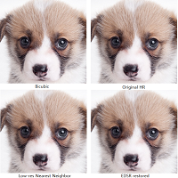
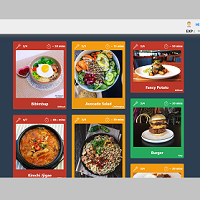
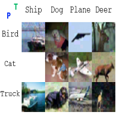
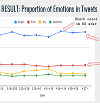
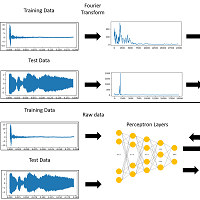
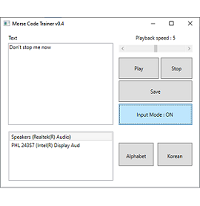
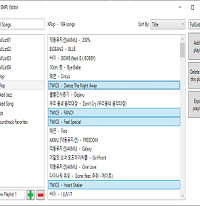
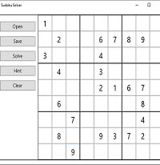
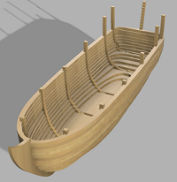

# 강민수 :kr: Minsoo Kang  
## Repositories that I am currently working on → [■](https://github.com/Mins0o/Market_Prediction_Playground)[■](https://github.com/Mins0o/HF_Transformer_Playground)[■](https://github.com/Mins0o/ComputerVisionPlayground) [□](https://github.com/Mins0o/CMakeTutorialFollowThrough) [...](https://github.com/Mins0o/Javascript-Practice) ...
---
<!--
**Mins0o/Mins0o** is a ✨ _special_ ✨ repository because its `README.md` (this file) appears on your GitHub profile.
-->

  
---
#### 🖥️⌨️💼🏬🌆 I work at Samsung Electronics in Suwon. My current hobbies are **Linux distro hopping**, setting up **local generative AI** systems, and **customizing keyboards**. 
I wish to do more projects about: 
1. Computer Vision 
2. Market Understanding 
3. Quantum Computing.  

### Education

Highschool : [GSHS](http://gshs-h.gne.go.kr/gshs-h/main.do) (2012 ~ 2014 - 2 years)  
Bachelor : [KAIST](https://kaist.ac.kr/kr/) (2014 ~ 2022)  
- Major#1\_\: [School of Computing](https://cs.kaist.ac.kr/)  
- Major#2\_\: [Mechanical Engineering](http://me.kaist.ac.kr/main/main.html)  
- Minor(1,2)\: [Industrial Design](https://id.kaist.ac.kr/), [College of Business](https://btm.kaist.ac.kr)  
- Club\_\_\_\_\:  MicroRobot Research Club [MR.](https://mr.kaist.ac.kr/) / RC Plane building club **ICARUS**  

Career :  
 - [Samsung Electronics Co.,Ltd. \[AIFW Engineer\] (2022 ~ )](https://www.linkedin.com/in/memesoo-kang/)  
---
## Projects  

  
  
##### To the right from upper left:  
- Haptic Button (Learning about the field HCI study - haptics)  
- Image Super Resolution Practice (Learning about SR)  
- Audio recognition door opener  
- Social recipe curation and shopping website - A team project from HCI course  
- Blackbox adversarial attack improved and expanded - Adding to [DeepSearch](https://dl.acm.org/doi/abs/10.1145/3368089.3409750) - A team project from SBSE course  
- Sentiment analysis on COVID-19 related tweets|Classification and trend analysis - A team project from NLP course  
- Machine Learning and Deep Learning practice - From data recording/preprocessing to classification/experiments  
- Morse code interaction GUI  
- Music playlist editing GUI  
- Simple search based Sudoku solver GUI  
- 3D modelling of a wooden boat that can be laser cut  

**[And more!](https://github.com/Mins0o?tab=repositories)**  
<!--

  
-->

---
---
**Want to add these features to your GitHub page?**  
[How to add a vanilla profile to your GitHub.](./CreateProfile.png)  
  
[How to add the widgets to your GitHub page.](https://github.com/anuraghazra/github-readme-stats/blob/master/readme.md "This feature is based on an app that runs on the OP's personal server. His server runs into traffic problems sometimes. If the `demo` is not showing up well, the server must be down. Go to the Deploy on your own Vercel instance section and deploy your own app to use it independently. This will require you to fork or clone the repository. I cloned the repositry and pushed it as a private repo of mine to use the source independently.")  
